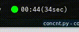
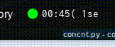
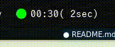

# observeAliveConnection



Showing network connection, and logging disconnection.

## Usage(Polybar)

First, clone this repository. For example, type shell to

```bash:shell
mkdir ~/.polybar-script/
git clone git@github.com:Kaniyama-t/observeAliveConnection.git
```

Second, open `~/.config/polybar/config` and add module profile at the end

```config:~/.config/polybar/config
[module/observe_connection]
type = custom/script
exec = ~/.polybar-script/observeAliveConnection/concnt.py
tail = true
interval = 1.0
label-padding = 2
```

Third, add `observe_connection` to `modules-right` or `modules-left` parameter.

```config:~/.config/polybar/config(Example)
modules-right = wlan observe_connection pulseaudio battery time
```

If you want to use Monospaced Font, please put the font to `font-6` at polybar's config or modify constant `I3BAR_FONT_MONO` at `concnt.py`.

And finally, press Super+Shift+R to reload i3bar.

## Optional: Scrolling Text



Modify the code at `line 63` in `concnt.py`

```
-            self.printForI3Bar(msg)
 +           self.printForI3Bar(self.scrollingText(msg))
```

## Optional: Show Recently Long Disconnection



Modify the code at `line 63` in `concnt.py`

```
-            self.printForI3Bar(msg)
 +           self.printForI3Bar(self.recentTimeText(msg))
```

## FAQ

### Where is log's path?

log will generate in `./log` directory as file named `YYYY-MM-DD.log`. For example `2021-06-01.log`.

### How to use log file?

You can generate scatter plot regarding *down time* and *down seconds*.

Log file's format is csv separated by `,` , so you can open libreoffice calc or anything software.

But, LibreOffice Calc don't support log's ISO-8601 format, so you must convert to `YYYY-MM-DD HH:MM:SS` . For example, you can use `RFC2822 datetime` in [this site with converting](https://dencode.com/ja/date).

On using *LibreOffice Calc* and *dencode.com*, you should setting property `Datetime(DMY)` to cells when paste datetime list.

For more detail, please watch this video.

